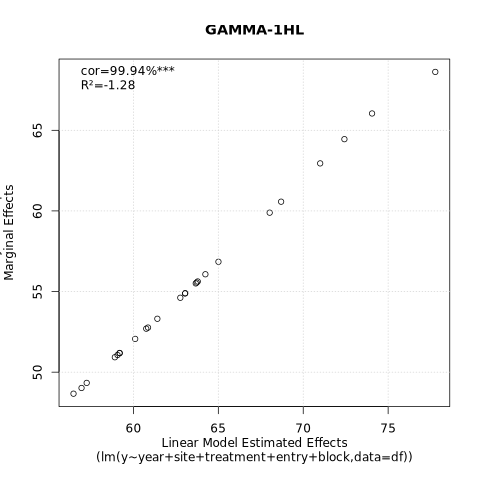
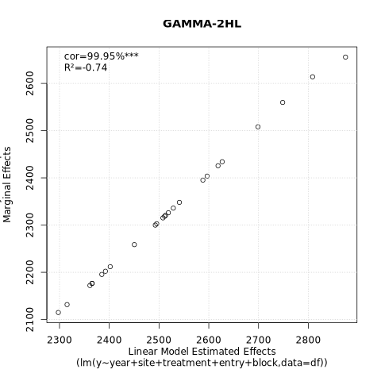
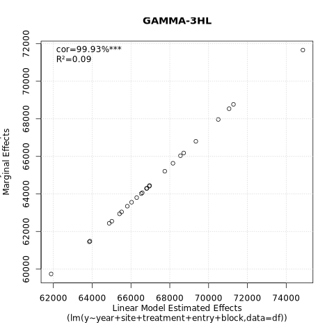
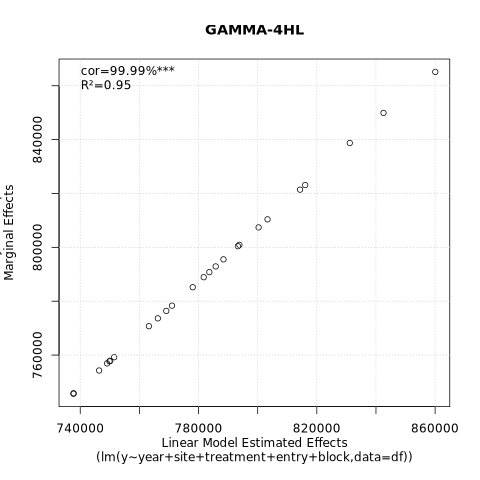
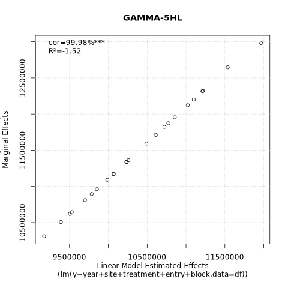
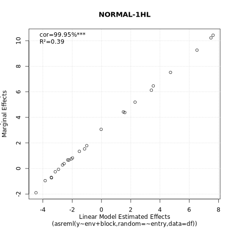
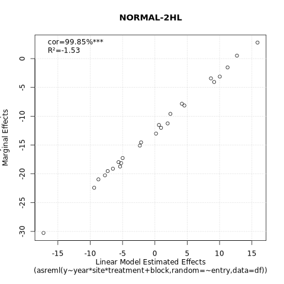
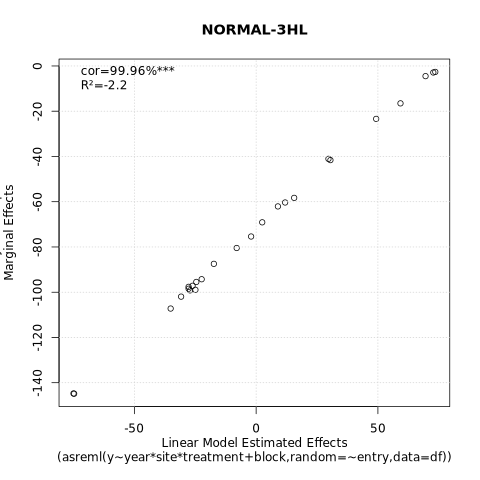
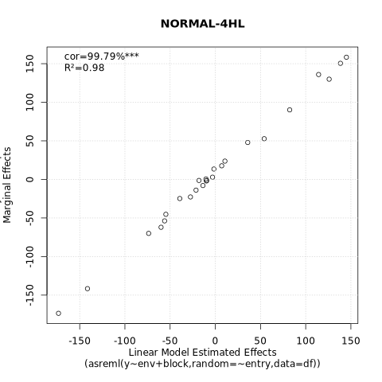
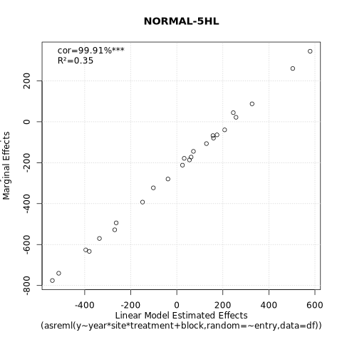

# mlp

Simple multilayer perceptron (MLP) from scratch

|**Build Status**|**License**|
|:--------------:|:---------:|
| <a href="https://github.com/jeffersonfparil/mlp/actions"></a> | [](https://www.gnu.org/licenses/gpl-3.0) |

# Quickstart

```shell
./mlp -h

Usage: mlp [OPTIONS]

Options:
  -f, --fname <FNAME>
          Input file name
  -d, --delim <DELIM>
          Delimiter for the input data file [default: "\t"]
  -t, --column-indices-of-targets <COLUMN_INDICES_OF_TARGETS>
          Vector of column indexes corresponding to the target values in the input data file [default: 0]
      --n-hidden-layers <N_HIDDEN_LAYERS>
          Number of hidden layers [default: 1]
      --n-hidden-nodes <N_HIDDEN_NODES>
          Number of nodes per hidden layer [default: 128]
      --dropout-rates <DROPOUT_RATES>
          Dropout rates per hidden layer [default: 0.0]
      --activation <ACTIVATION>
          Activation function (Choose from: "ReLU", "Sigmoid", "HyperbolicTangent") (Note: "LeakyReLU" under construction) [default: ReLU]
      --cost <COST>
          Cost function (Choose: "MSE", "MAE", "HL") [default: MSE]
      --optimiser <OPTIMISER>
          Optimiser (Choose: "Adam", "AdamMax", "GradientDescent") [default: Adam]
      --n-epochs <N_EPOCHS>
          Maximum number of training epochs [default: 10]
      --f-patient-epochs <F_PATIENT_EPOCHS>
          Fraction of the maximum number of epochs to wait before enabling the criteria for early stopping [default: 0.25]
      --n-batches <N_BATCHES>
          Number of training batches to split the input data into [default: 2]
      --learning-rate <LEARNING_RATE>
          Learning rate (η) [default: 0.001]
      --first-moment-decay <FIRST_MOMENT_DECAY>
          First moment decay (β₁) [default: 0.001]
      --second-moment-decay <SECOND_MOMENT_DECAY>
          Second moment decay (β₁) [default: 0.999]
      --epsilon <EPSILON>
          Small value used for numerical stability (ϵ; usually to avoid dividing by zero) [default: 0.00000001]
      --seed <SEED>
          Randomisation seed [default: 123]
  -o, --fname-network-output <FNAME_NETWORK_OUTPUT>
          Filename of the output model (Default: "output_network-{%Y%m%d%H%M%S}.json")
  -v, --verbose
          Verbose
      --hyperparameter-optimisation
          Hyperparameter optimisation
      --range-hidden-layers <RANGE_HIDDEN_LAYERS>
          Range of number of hidden layers for hyperparameter optimisation (elements correspond to minimum, maximum and step size) [default: 1,2,1]
      --range-hidden-layer-nodes <RANGE_HIDDEN_LAYER_NODES>
          Range of number of nodes per hidden layer for hyperparameter optimisation (elements correspond to minimum, maximum and step size) [default: 100,100,100]
      --range-dropout-rates <RANGE_DROPOUT_RATES>
          Range of dropout rates per hidden layer for hyperparameter optimisation (elements correspond to minimum, maximum and step size) [default: 0.0,0.0,0.01]
      --range-learning-rates <RANGE_LEARNING_RATES>
          Range of learning rates for hyperparameter optimisation (elements correspond to minimum, maximum and step size) [default: 1e-5,1e-5,1e-5]
      --range-n-epochs <RANGE_N_EPOCHS>
          Range of maximum number of training epochs for hyperparameter optimisation (elements correspond to minimum, maximum and step size) [default: 10,10,10]
      --range-f-patient-epochs <RANGE_F_PATIENT_EPOCHS>
          Range of proportions of the maximum training epochs to start considering early stopping for hyperparameter optimisation (elements correspond to minimum, maximum and step size) [default: 0.5,1.0,0.5]
      --range-n-batches <RANGE_N_BATCHES>
          Range of number of batches to split the dataset for hyperparameter optimisation (elements correspond to minimum, maximum and step size) [default: 1,2,1]
      --selection-activations <SELECTION_ACTIVATIONS>
          Activation functions to test [default: ReLU]
      --selection-costs <SELECTION_COSTS>
          Cost functions to test [default: MSE]
      --selection-optimisers <SELECTION_OPTIMISERS>
          Optimisers to test [default: GradientDescent,Adam]
      --predict-only
          Predict using a fitted network (fitted MLP model)
  -m, --model <MODEL>
          File name of the MLP model in JSON format
  -M, --marginals-only
          Marginal effects estimation only
      --skip-marginals
          
      --marginals-order <MARGINALS_ORDER>
          Maximum number of interaction effects level, i.e. order 1 includes only the main effects, order 2 includes the main effects and pairwise interactions, and so on [default: 1]
      --n-interpolate-min-max <N_INTERPOLATE_MIN_MAX>
          Number of input values across the observed range per feature (or input node) to use in predictions i.e. number of values for interpolate between minimum and maximum values observed in each feature or input node [default: 10]
  -D, --deep-shap
          Use DeepSHAP instead of the perturbation method Note that the current implementation of DeepSHAP generates only main effects and no interaction effects. Do not enable this flag to use the default perturbation method if you require marginal interaction effects
      --deep-shap-reps <DEEP_SHAP_REPS>
          Number of replications for DeepSHAP main effects estimation Each replication samples feature values from their normally distributed values [default: 10]
  -s, --simulate-data-only
          Simulate data only
  -n, --simulation-n-observations <SIMULATION_N_OBSERVATIONS>
          Number of observations to simulate [default: 100]
  -p, --simulation-n-features-continuous <SIMULATION_N_FEATURES_CONTINUOUS>
          Number of continuous features to simulate [default: 10]
  -q, --simulation-n-features-categorical <SIMULATION_N_FEATURES_CATEGORICAL>
          Number of continuous features to simulate [default: 2,3,5]
  -k, --simulation-n-output-columns <SIMULATION_N_OUTPUT_COLUMNS>
          Number of simulated output column [default: 1]
  -l, --simulation-n-hidden-layers <SIMULATION_N_HIDDEN_LAYERS>
          Number of hidden layers to use to simulate the output data [default: 2]
      --simulation-weights-distribution <SIMULATION_WEIGHTS_DISTRIBUTION>
          Two-parameter distribution from which the simulated weights will be sample from Select from: "normal","lognormal","cauchy","weibull","gamma","beta" [default: normal]
      --simulation-weights-distribution-param-1 <SIMULATION_WEIGHTS_DISTRIBUTION_PARAM_1>
          First parameter of the distribution from which the weights will be sampled from [default: 0]
      --simulation-weights-distribution-param-2 <SIMULATION_WEIGHTS_DISTRIBUTION_PARAM_2>
          First parameter of the distribution from which the weights will be sampled from [default: 1]
  -h, --help
          Print help (see more with '--help')
  -V, --version
          Print version
```

# Development setup

1. Install [pixi](https://pixi.prefix.dev/):

```shell
wget -qO- https://pixi.sh/install.sh | sh
```

2. Setup the workspace:

```shell
git clone https://github.com/jeffersonfparil/mlp.git
cd mlp
pixi init
```

3. Add cargo, cuda-nvrtc:

```shell
cd mlp
pixi shell
pixi add rust
pixi add cuda-nvrtc==12.8.93
which cargo
ls -lhtr ${PIXI_PROJECT_ROOT}/.pixi/envs/default/lib/libnvrtc*
```

# Unit testing

```shell
cd mlp
pixi shell
# export LD_LIBRARY_PATH=${PIXI_PROJECT_ROOT}/.pixi/envs/default/lib
time cargo test -- --show-output
```

# More testing

```shell
cd mlp
pixi shell
# export LD_LIBRARY_PATH=${PIXI_PROJECT_ROOT}/.pixi/envs/default/lib
time cargo run -- -h
time cargo run -- -s -n1000 -p10 -v
# time cargo run -- -s -n1024 -p32768 -q0 -v # 13 minutes on gpu001: Intel(R) Xeon(R) Gold 5418Y 24 cores with 1 NVIDIA H100 NVL (93.584Gi)
INPUT=$(ls -t1 | grep "input.*.tsv" | head -n1)
head $INPUT | cut -f1-10
head -n1 $INPUT | awk '{print NF}'
time cargo run -- -f $INPUT -v --n-batches=1 --n-epochs=1000 --skip-marginals
MODEL=$(ls -t1 | grep "output.*.json" | head -n1)
head $MODEL | cut -f1-10
tail $MODEL | cut -f1-10
time cargo run -- -f $INPUT -v -m $MODEL --predict-only
PREDICTED=$(ls -t1 | grep "output.*-predictions.tsv" | tail -n1)
head $PREDICTED | cut -f1-10
time cargo run -- -f $INPUT -v -m $MODEL --marginals-only --marginals-order=1
MARGINALS=$(ls -t1 | grep "output.*-marginal_effects.tsv" | head -n1)
mv $MARGINALS marginal_main.tsv
time cargo run -- -f $INPUT -v -m $MODEL --marginals-only --marginals-order=2
MARGINALS=$(ls -t1 | grep "output.*-marginal_effects.tsv" | head -n1)
mv $MARGINALS marginal_2nd.tsv
time cargo run -- -f $INPUT -v -m $MODEL --marginals-only --marginals-order=3
MARGINALS=$(ls -t1 | grep "output.*-marginal_effects.tsv" | head -n1)
mv $MARGINALS marginal_3rd.tsv
time cargo run -- -f $INPUT -v -m $MODEL --marginals-only --deep-shap --deep-shap-reps=100
MARGINALS=$(ls -t1 | grep "output.*-marginal_effects.tsv" | head -n1)
mv $MARGINALS deep_shap.tsv
head marginal_main.tsv
head marginal_2nd.tsv
head marginal_3rd.tsv
head deep_shap.tsv
```

# Compile for release

```shell
cd mlp
cargo build --release
./target/release/mlp -h
```

# Example Fits

Using 2 hidden layers, 128 nodes per hidden layer, ReLU activation, Adam optimiser, 0.001 learning rate and, 25% patient epochs:

## 10 Epochs


## 20 Epochs


## 50 Epochs


## 100 Epochs


# Special characters

- Used in progress bars: `█`
- Used as delimiters between non-numeric or categorical variable names and their levels: `➵`
- Used as delimiters in marginals' combinations: `▓`

# Field trial analysis

Evaluation of the performance of MLP model on yield trial data:

- simulated multi-environment field trials datasets (multiple years, sites, treatments, entries, and replications in RCBD)
- empirical data from *agridat*
- comparison against linear models in R: selecting the best model among `lm`, `lmer`, and `asreml` models

## Tests on simulated data

We simulated:
- 21,000 observations of
- 1 response variable across 
- 7 years
- 20 sites
- 2 treatments
- 25 entries
- 3 replications (blocks)
- in a multi-environment trial
- in randomised complete block design (RCBD) per environment
- using a multi-layer perceptron with:
    + 1, 2, 3, 4, and 5 hidden layers whose effects are:
    + normally (μ=0, σ=1) and gamma (α=2, θ=2) distributed.

<details>

### Simulate data

```shell
cd mlp/
mkdir tests/simulated
cd tests/simulated
MLP=../../target/release/mlp
N_YEARS=7
N_SITES=20
N_TREATMENTS=2
N_ENTRIES=25
N_REPLICATIONS=3
for HIDDEN_LAYERS in $(seq 1 5)
do
    # HIDDEN_LAYERS=1
    F_NORMAL=input_simulated-NORMAL-${HIDDEN_LAYERS}HL.tsv
    F_GAMMA=input_simulated-GAMMA-${HIDDEN_LAYERS}HL.tsv
    echo "######################"
    echo "$F_NORMAL and $F_GAMMA"
    $MLP \
        --simulate-data-only \
        --simulation-n-observations $(echo "$N_YEARS*$N_SITES*$N_TREATMENTS*$N_ENTRIES*$N_REPLICATIONS" | bc) \
        --simulation-n-features-continuous 0 \
        --simulation-n-features-categorical "$N_YEARS,$N_SITES,$N_TREATMENTS,$N_ENTRIES,$N_REPLICATIONS" \
        --simulation-n-output-columns 1 \
        --simulation-n-hidden-layers ${HIDDEN_LAYERS} \
        --simulation-weights-distribution normal \
        --simulation-weights-distribution-param-1 0 \
        --simulation-weights-distribution-param-2 1 \
        --seed ${HIDDEN_LAYERS}
    F0=$(ls -lhtr input_simulated-*.tsv | tail -n1 |  rev | awk '{print $1}' | rev)
    sed 's/target_0/y/g' $F0 | sed 's/fcat_0/year/g' | sed 's/fcat_1/site/g' | sed 's/fcat_2/treatment/g' | sed 's/fcat_3/entry/g' | sed 's/fcat_4/block/g'> tmp
    mv tmp $F0
    mv $F0 $F_NORMAL
    $MLP \
        --simulate-data-only \
        --simulation-n-observations $(echo "$N_YEARS*$N_SITES*$N_TREATMENTS*$N_ENTRIES*$N_REPLICATIONS" | bc) \
        --simulation-n-features-continuous 0 \
        --simulation-n-features-categorical "$N_YEARS,$N_SITES,$N_TREATMENTS,$N_ENTRIES,$N_REPLICATIONS" \
        --simulation-n-output-columns 1 \
        --simulation-n-hidden-layers ${HIDDEN_LAYERS} \
        --simulation-weights-distribution gamma \
        --simulation-weights-distribution-param-1 0.5 \
        --simulation-weights-distribution-param-2 1.5 \
        --seed ${HIDDEN_LAYERS}
    F1=$(ls -lhtr input_simulated-*.tsv | tail -n1 |  rev | awk '{print $1}' | rev)
    sed 's/target_0/y/g' $F1 | sed 's/fcat_0/year/g' | sed 's/fcat_1/site/g' | sed 's/fcat_2/treatment/g' | sed 's/fcat_3/entry/g' | sed 's/fcat_4/block/g'> tmp
    mv tmp $F1
    mv $F1 $F_GAMMA
done
```

### Analysis using R

#### Run the script:

```shell
cd mlp
cd tests/simulated
module load ASReml-R # if ASReml-R is available
time Rscript script_LINEAR.R
```

#### See details below (`tests/simulated/script_LINEAR.R`):

```R
library("stringr")
library("lme4")
if (nzchar(system.file(package = "asreml"))) {
    library("asreml") # requires ```shell module load ASReml-R ```
}

process_features = function(df) {
    ids_features = c()
    for (j in 1:ncol(df)) {
        # j = 7
        if (is.character(df[, j])) {
            df[, j] = as.factor(df[, j])
            ids_features = c(ids_features, paste0(names(df)[j], sort(levels(df[, j]))))
        }
    }
    for (v in c("year", "site", "treatment", "entry", "block")) {
        if (!is.factor(df[[v]])) df[[v]] = as.factor(df[[v]])
    }
    # Include an env variable merging years, sites, and treatments into 1 factor
    df$env = paste0("year_", df$year, "|site_", df$site, "|treatment_", df$treatment)
    df$env = as.factor(df$env)
    return(list(
        df=df, 
        ids_features=ids_features
    ))
}

AIC_lm_lmer_asreml = function(mod) {
    # mod = model_candidates[[13]]
    if ((class(mod) == "lm") | (class(mod) == "lmerMod")) {
        return(AIC(mod))
    } else if (class(mod) == "asreml") {
        return(-2*mod$loglik + 2*nrow(summary(mod)$varcomp))
    } else {
        # print("Unknown model class. We expect 'lm', 'lmerMod' or 'asreml'.")
        NA
    }
}
BIC_lm_lmer_asreml = function(mod) {
    # mod = model_candidates[[13]]
    if ((class(mod) == "lm") | (class(mod) == "lmerMod")) {
        return(BIC(mod))
    } else if (class(mod) == "asreml") {
        return(-2*mod$loglik + nrow(summary(mod)$varcomp)*log(summary(mod)$nedf))
    } else {
        # print("Unknown model class. We expect 'lm', 'lmerMod' or 'asreml'.")
        NA
    }
}
logLik_lm_lmer_asreml = function(mod) {
    # mod = model_candidates[[1]]
    if ((class(mod) == "lm") | (class(mod) == "lmerMod")) {
        return(as.numeric(logLik(mod)))
    } else if (class(mod) == "asreml") {
        return(mod$loglik)
    } else {
        # print("Unknown model class. We expect 'lm', 'lmerMod' or 'asreml'.")
        NA
    }
}
ndf_lm_lmer_asreml = function(mod) {
    # mod = model_candidates[[13]]
    if ((class(mod) == "lm") | (class(mod) == "lmerMod")) {
        return(attr(logLik(mod), "df"))
    } else if (class(mod) == "asreml") {
        return(summary(mod)$nedf)
    } else {
        # print("Unknown model class. We expect 'lm', 'lmerMod' or 'asreml'.")
        NA
    }
}

fit_extract_effects = function(df) {
    lm_model_strings = c(
        "lm(y ~ year + site + treatment + entry + block, data=df)",
        "lm(y ~ year * site + treatment + entry + block, data=df)",
        "lm(y ~ env + entry + block, data=df)"
    )
    lmer_model_strings = c(
        'lmer(y ~ year + site + treatment + block + (1|entry), df)',
        'lmer(y ~ year * site + treatment + block + (1|entry), df)',
        # 'lmer(y ~ year * site * treatment + block + (1|entry), df)',
        # 'lmer(y ~ year * site + treatment + block + (1 + year|entry), df)',
        'lmer(y ~ year + site + treatment + block + (1|entry) + (1|entry:year) + (1|entry:site), df)',
        'lmer(y ~ env + block + (1|entry), df)',
        'lmer(y ~ env + block + (1|entry) + (1|entry:env), df)'
    )
    asreml_model_strings = c(
        'asreml(y ~ year + site + treatment + block, random = ~ entry, data = df)',
        'asreml(y ~ year * site + treatment + block, random = ~ entry, data = df)',
        'asreml(y ~ year * site * treatment + block, random = ~ entry, data = df)',
        'asreml(y ~ year * site + treatment + block, random = ~ entry + fa(site):entry, data = df)',
        'asreml(y ~ year * site + treatment + block, random = ~ entry + fa(year):entry, data = df)',
        'asreml(y ~ year * site * treatment + block, random = ~ entry + fa(year:site):entry, data = df)',
        'asreml(y ~ year + site + treatment + block, random = ~ entry + entry:year + entry:site, data = df)',
        'asreml(y ~ env + block, random = ~ entry, data = df)',
        'asreml(y ~ env + block, random = ~ entry + fa(env):entry, data = df)'

    )
    model_strings = if (nzchar(system.file(package = "asreml"))) {
        c(lm_model_strings, lmer_model_strings, asreml_model_strings)
    } else {
        c(lm_model_strings, lmer_model_strings)
    }
    # Fit these models
    model_candidates = list()
    for (i in 1:length(model_strings)) {
        # i = 1
        # i = length(model_strings)
        mod_string = model_strings[i]
        mod_label = unlist(strsplit(mod_string, "\\("))[1]
        print(paste0("Fitting ", mod_label, "_", i, ": `", mod_string, "`"))
        mod = tryCatch(
            eval(parse(text=mod_string)),
            error = function(e) {
                print("Unable to fit: skipped!")
                return(NA)
            }
        )
        if ((length(mod) == 1) && is.na(mod)) {
            model_candidates[[paste0(mod_label, "_", i)]] = NA
        } else {
            if (class(mod) == "lmerMod") {
                if (mod@optinfo$conv$opt == 0) {
                    # Failed to converge
                    model_candidates[[paste0(mod_label, "_", i)]] = NA
                } else {
                    model_candidates[[paste0(mod_label, "_", i)]] = mod
                }
            } else if (class(mod) == "asreml") {
                if (mod$converge == FALSE) {
                    model_candidates[[paste0(mod_label, "_", i)]] = NA
                } else {
                    model_candidates[[paste0(mod_label, "_", i)]] = mod
                }
            } else {
                model_candidates[[paste0(mod_label, "_", i)]] = mod
            }
        }
    }
    df_stats = data.frame(
        model = names(model_candidates),
        formula = model_strings,
        AIC = sapply(model_candidates, AIC_lm_lmer_asreml),
        BIC = sapply(model_candidates, BIC_lm_lmer_asreml),
        logLik = sapply(model_candidates, logLik_lm_lmer_asreml)
    )
    z_AIC = scale(df_stats$AIC, scale=T, center=T)
    z_BIC = scale(df_stats$BIC, scale=T, center=T)
    z_logLik = -scale(df_stats$logLik, scale=T, center=T)
    df_stats$z_sum = 0.2*z_AIC + 0.6*z_BIC + 0.2*z_logLik
    print(df_stats)
    # Select the best model based on z_sum
    # best_model_idx = which.min(df_stats$BIC)
    best_model_idx = which.min(df_stats$z_sum)
    best_model = model_candidates[[best_model_idx]]
    best_model_formula = df_stats$formula[best_model_idx]
    print(paste("Best model selected:", best_model_formula))

    # Plot entry effects (random effects for entry)
    # best_model = model_candidates[[1]]
    df_effects = if (class(best_model) == "lm") {
        # best_model = model_candidates[[1]]
        effects = coef(best_model)
        ids = names(effects)
        intercept = effects[ids == "(Intercept)"]
        entry_effects = c(intercept, intercept + effects[grepl("entry", ids)])
        entry_names = c(as.character(levels(df$entry)[1]), ids[grepl("entry", ids)])
        entry_names = gsub("entry", "", entry_names)
        df_effects = data.frame(ids=entry_names, effects=entry_effects)
        rownames(df_effects) = NULL
        df_effects
        # barplot(entry_effects, names.arg=entry_names, main = "Estimated Entry Effects (fixed effects model)", xlab = "Entry", ylab = "Coefficients")
    } else if (class(best_model) == "lmerMod") {
        # best_model = model_candidates[[3]]
        entry_effects <- ranef(best_model)$entry
        df_effects = data.frame(ids=rownames(entry_effects), effects=entry_effects[,1])
        rownames(df_effects) = NULL
        df_effects
        # barplot(entry_effects[,1], names.arg = rownames(entry_effects), main = "Estimated Entry Effects (mixed model)", xlab = "Entry", ylab = "Random Effect")
    } else if (class(best_model) == "asreml") {
        # best_model = model_candidates[[13]]
        df_effects = data.frame(
            ids = rownames(coef(best_model)$random),
            effects = as.vector(coef(best_model)$random)
        ); row.names(df_effects) = NULL
        # str(df_effects)
        df_sub = df_effects[grepl("entry", df_effects$ids) & !grepl(":", df_effects$ids), ]
        df_sub$ids = gsub("entry_", "", df_sub$ids)
        df_effects
        # barplot(df_sub$effects, names.arg = df_sub$ids, main = "Estimated Entry Effects (asreml model)", xlab = "Entry", ylab = "Random Effect")
    } else {
        data.frame()
        # plot(0, 0)
        # print("Unknown model class. We expect 'lm', 'lmerMod' or 'asreml'.")
    }
    # Add the expected delimiters for these "marginal" effects
    df_effects$ids = gsub("_level", "➵level", df_effects$ids)
    df_effects$ids = gsub(":", "▓", df_effects$ids)
    # Sort sensibly
    df_effects = df_effects[stringr::str_order(df_effects$ids, numeric=TRUE), ]
    return(list(
        df_effects=df_effects,
        formula=best_model_formula
    ))
}

### Fit and extract entry effects
fnames = list.files(path=".", pattern="input_simulated")
output = list()
for (fname_input in fnames) {
    # fname_input = fnames[1]
    input_list = process_features(df=read.delim(fname_input, T))
    df = input_list$df
    ids_features = input_list$ids_features
    attach(df)
    print("@@@@@@@@@@@@@@@@@@@@@@@@@@@@@@@@@@@@@@@@@@@@@@@@@@@@@@@@@@@@@@@@@@@")
    print(fname_input)
    out = fit_extract_effects(df)
    fname_output = paste0(
        gsub("^input", "output", gsub(".tsv", "", fname_input)),
        "-LINEAR_",
        gsub(" ", "", out$formula), 
        ".tsv"
    )
    write.table(out$df_effects, file=fname_output, row.names=FALSE, col.names=TRUE, sep="\t")
    output[[fname_input]] = out
    detach(df)
}
```

### Analysis using mlp

#### Run the script:

```shell
cd mlp
cd tests/simulated
time sh script_MLP.sh
```

#### See details below (`tests/simulated/script_MLP.sh`):

```shell
#!/bin/bash

# cd mlp/
# cd tests/simulated
mkdir mlp_misc_output
MLP=../../target/release/mlp
N_EPOCHS=500
F_PATIENT_EPOCHS=0.01
N_BATCHES=2
N_HIDDEN_LAYERS=1
N_HIDDEN_NODES=64
MARGINALS_ORDER=1
for INPUT in $(ls input_simulated-*-*.tsv)
do
    # INPUT=$(ls input_simulated-*-*.tsv | head -n2 | tail -n1)
    # INPUT=input_simulated-NORMAL-1HL.tsv
    echo $INPUT
    # N_EPOCHS=$(echo "500 * ($N_HIDDEN_LAYERS / 2)" | bc)
    # N_HIDDEN_LAYERS=$(echo $(echo ${INPUT%.tsv*} | rev | cut -d'-' -f1 | rev | sed 's/HL//g') + 1 | bc)
    OUTPUT=$(echo $INPUT | sed 's/input_simulated/output_simulated/g' | sed "s/.tsv/-MLP_E${N_EPOCHS}_F${F_PATIENT_EPOCHS}_B${N_BATCHES}_H${N_HIDDEN_LAYERS}_M${MARGINALS_ORDER}.json/g")
    echo $OUTPUT
    time ${MLP} -f ${INPUT} -o ${OUTPUT} -v --n-epochs=${N_EPOCHS} --f-patient-epochs=${F_PATIENT_EPOCHS} --n-batches=${N_BATCHES} --n-hidden-layers=${N_HIDDEN_LAYERS} --n-hidden-nodes=${N_HIDDEN_NODES} --marginals-order=${MARGINALS_ORDER}
    TMP_OUTDIR=mlp_misc_output/${OUTPUT%.*}
    mkdir $TMP_OUTDIR
    mv $OUTPUT mlp_misc_output/${OUTPUT%.*}
    mv *.svg mlp_misc_output/${OUTPUT%.*}
    mv *.png mlp_misc_output/${OUTPUT%.*}
done
```

### Comparison between linear mixed model and mlp

#### Run the script:

```shell
cd mlp
cd tests/simulated
time Rscript script_COMPARISON.R
```

#### See details below (`tests/simulated/script_COMPARISON.R`):

```R
fnames_INPUT = list.files(".", pattern="input")
fnames_LINEAR = list.files(".", pattern="output_.*-LINEAR")
fnames_MLP = list.files(".", pattern="output_.*-MLP")
for (fname_input in fnames_INPUT) {
    # fname_input = fnames_INPUT[1]
    id = gsub("input_simulated-", "", gsub(".tsv", "", fname_input))
    fname_linear = fnames_LINEAR[grep(id, fnames_LINEAR)]
    fname_mlp = fnames_MLP[grep(id, fnames_MLP)]
    # Load the effects from the best linear model
    df_linear = read.delim(fname_linear, T)
    if (length(grep("➵", df_linear$ids)) > 0) {
        df_linear = df_linear[grep("^entry", df_linear$ids), ]
        df_linear$ids = gsub("entry➵", "", df_linear$ids)
    }
    colnames(df_linear)[2] = "linear"
    # Load the marginal effects from mlp
    df_mlp = read.delim(fname_mlp, T)
    df_mlp = df_mlp[grep("^entry", df_mlp$ids), 1:2]
    df_mlp$ids = gsub("entry➵", "", df_mlp$ids)
    colnames(df_mlp)[2] = "mlp"
    # Merge
    df = merge(df_linear, df_mlp, by="ids")
    # Calculate the correlation and R2
    cortest = cor.test(df$linear, df$mlp)
    annot = if (cortest$p.value < 0.0001) {
        "***"
    } else if (cortest$p.value < 0.001) {
        "**"
    } else if (cortest$p.value < 0.01) {
        "*"
    } else {
        "ns"
    }
    R2 = mean(c(1 - (sum((df$linear - df$mlp)^2) / sum((df$linear - mean(df$linear))^2)), 1 - (sum((df$linear - df$mlp)^2) / sum((df$mlp - mean(df$mlp))^2))))
    # Plot
    fname_png = paste0("comparison-", id, ".png")
    linear_model_formula = gsub(paste0("output_simulated-", id, "-LINEAR_"), "", gsub(".tsv", "", fname_linear))
    png(fname_png)
    plot(df$linear, df$mlp, xlab=paste0("Linear Model Estimated Effects\n(", linear_model_formula, ")"), ylab="Multi-layer Perceptron\nMarginal Effects", main=id)
    grid()
    text(min(df$linear), max(df$mlp), label=paste0("\n\ncor=", round(100*cortest$estimate, 2), "%", annot, "\nR²=", round(R2, 2)), pos=c(4, 1))
    dev.off()
}
```

</details>

#### GAMMA-1HL



#### GAMMA-2HL



#### GAMMA-3HL



#### GAMMA-4HL



#### GAMMA-5HL



#### NORMAL-1HL



#### NORMAL-2HL



#### NORMAL-3HL



#### NORMAL-4HL



#### NORMAL-5HL




## Tests on empirical data

Using agridat data... details: how many? types?

<details>

### Prepare test data

- Explanatory variables can be numeric or categorical which means that explanatory variables which are written as numeric but are meant to be categorical need to be converted into strings, e.g. convert `rep=[1, 1, 1, 2, 2, 2, 3, 3]` into `rep=["rep➵1", "rep➵1", "rep➵1", "rep➵2", "rep➵2", "rep➵2", "rep➵3", "rep➵3"]`.
- We exclude covariance and uniformity datasets.
- We only include datasets with the genotype (`gen`) variable because we are testing `mlp`'s applicability for breeding, i.e. we want to rank the genotypes for selection.
- We then generate one file with a single response variable named `y` in the first column followed by the explanatory variables.

#### Download agridat data:

```shell
cd mlp/
cd tests/
mkdir agridat/
cd agridat/
curl -L https://codeload.github.com/kwstat/agridat/tar.gz/main | tar -xz --strip=2 agridat-main/data
```

#### Prepare the data, i.e. make sure categorical variables are interpretted as strings

```R
setwd("tests/agridat")
fnames = list.files(path=".", pattern=".txt$")
fnames = fnames[!grepl(".covs.txt", fnames)]
fnames = fnames[!grepl(".uniformity.txt", fnames)]
for (fname in fnames) {
    # fname = fnames[261]
    # fname = "archbold.apple.txt"
    # fname = "acorsi.grayleafspot.txt"
    # fname = "alwan.lamb.txt"
    # fname = "aastveit.barley.height.txt"
    df = read.table(fname, header=TRUE, na.strings=c("", "NA", "NAN", "NaN", "na", "nan"))
    # print("@@@@@@@@@@@@@@@@@@@@@@@@@@@@@@@")
    # print(fname)
    # print(str(df))
    # readline(prompt="Press [enter] to proceed")
    # }
    potential_explanatory_names = c(
        "gen", "gens",
        "genotype", "genotypes",
        "entry", "entries",
        "pig", "pigs",
        "animal", "animals",
        "id", "ids",
        "breed", "breeds",
        "sire", "sires",
        "male", "males",
        "female", "females",
        "tree", "trees",
        "group", "groups",
        "zone", "zones",
        "isle", "isles",
        "sex",
        "pop", "pops",
        "var", "vars",
        "env", "envs",
        "year", "years",
        "loc", "locs",
        "harvest", "harvests",
        "season", "seasons",
        "plot", "plots",
        "rep", "reps",
        "row", "rows",
        "col", "cols",
        "blk", "blks",
        "genotype", "genotypes",
        "population", "populations",
        "variety", "varieties",
        "cultivar", "cultivars",
        "replication", "replications",
        "column", "columns",
        "block", "blocks",
        "pos", "position", "positions",
        "spacing", "spacings",
        "stock", "stocks",
        "trt", "trts",
        "treatment", "treatments"
    )
    potential_response_names = c(
        "yield",
        "grain",
        "straw",
        "height",
        "size",
        "lodging",
        "protein",
        "oil"
    )
    explanatory_names = c()
    response_names = c()
    for (j in 1:ncol(df)) {
        # j = 1
        id = names(df)[j]
        y = df[, j]
        n = length(y)
        if (id %in% potential_explanatory_names) {
            if (is.numeric(y)) {
                if ((length(unique(y)) > 5) && (var(y, na.rm=TRUE) > 1e-7)) {
                    response_names = c(response_names, id)
                } else {
                    explanatory_names = c(explanatory_names, id)
                    df[, j] = paste0(id, "➵", y)
                }
            } else {
                explanatory_names = c(explanatory_names, id)
            }
        } else {
            if (id %in% potential_response_names) {
                response_names = c(response_names, id)
            } else {
                if (is.character(y)) {
                    explanatory_names = c(explanatory_names, id)
                } else if ((length(unique(y)) < 5) | (var(y, na.rm=TRUE) < 1e-7)) {
                    explanatory_names = c(explanatory_names, id)
                    df[, j] = paste0(id, "➵", y)
                } else {
                    response_names = c(response_names, id)
                }
            }
        }
    }
    idx_explanatories = which(names(df) %in% explanatory_names)
    # print(colnames(df[idx_explanatories]))
    if (length(idx_explanatories) == 0) {
        next
    }
    # FOR SIMPLICITY WE ARE ONLY INCLUDING THOSE DATASETS WITH `gen` because we are ultimately interested in ranking genotypes for breeding purposes
    if (!("gen" %in% colnames(df)[idx_explanatories])) {
        next
    }
    if (max(unique(table(df$gen))) == 1) {
        next
    }
    df_explanatories = df[, idx_explanatories, drop=FALSE]
    for (y_name in response_names) {
        # y_name = response_names[1]
        df_out = cbind(data.frame(y=df[, which(names(df) == y_name)]), df_explanatories)
        fname_out = gsub(".txt", paste0("-", y_name, ".tsv"), fname)
        write.table(df_out, file=fname_out, sep="\t", row.names=FALSE, col.names=TRUE, quote=FALSE)
        print(paste0("Processed: `", fname_out, "`"))
    }
}
```

### R

Fit linear models in R using `lm`, `lmer` and `asreml` (if available)

#### Generic model selection

##### Run:

```shell
cd tests/agridat
time Rscript ...
```

##### Details (`...`):

```R
library("stringr")
library("lme4")
if (nzchar(system.file(package = "asreml"))) {
    library("asreml") # requires ```shell module load ASReml-R ```
}

# length(list.files(path=".", pattern=".tsv$"))

process_features = function(df) {
    # fname = list.files(path=".", pattern=".tsv$")[19]; df = read.table(fname, sep="\t", header=TRUE, na.strings=c("", "NA", "NAN", "NaN", "na", "nan"))
    # Assuming only the first column is the numeric response variable and the rest are non-numeric explanatory variables
    ids_features = colnames(df)[2:ncol(df)]
    for (j in 2:ncol(df)) {
        df[, j] = as.factor(df[, j])
    }
    if (length(ids_features) > 2) {
        idx = which((names(df) != "y") & (names(df) != "gen"))
        df$dummy_env = apply(df[, idx, drop=FALSE], MARGIN=1, FUN=function(x){paste(x, collapse="|")})
        ids_features = c(ids_features, "dummy_env")
    }
    # str(df)
    return(list(
        df=df, 
        ids_features=ids_features
    ))
}

AIC_lm_lmer_asreml = function(mod) {
    # mod = model_candidates[[13]]
    if ((class(mod) == "lm") | (class(mod) == "lmerMod")) {
        return(AIC(mod))
    } else if (class(mod) == "asreml") {
        return(-2*mod$loglik + 2*nrow(summary(mod)$varcomp))
    } else {
        # print("Unknown model class. We expect 'lm', 'lmerMod' or 'asreml'.")
        NA
    }
}
BIC_lm_lmer_asreml = function(mod) {
    # mod = model_candidates[[13]]
    if ((class(mod) == "lm") | (class(mod) == "lmerMod")) {
        return(BIC(mod))
    } else if (class(mod) == "asreml") {
        return(-2*mod$loglik + nrow(summary(mod)$varcomp)*log(summary(mod)$nedf))
    } else {
        # print("Unknown model class. We expect 'lm', 'lmerMod' or 'asreml'.")
        NA
    }
}
logLik_lm_lmer_asreml = function(mod) {
    # mod = model_candidates[[1]]
    if ((class(mod) == "lm") | (class(mod) == "lmerMod")) {
        return(as.numeric(logLik(mod)))
    } else if (class(mod) == "asreml") {
        return(mod$loglik)
    } else {
        # print("Unknown model class. We expect 'lm', 'lmerMod' or 'asreml'.")
        NA
    }
}
ndf_lm_lmer_asreml = function(mod) {
    # mod = model_candidates[[13]]
    if ((class(mod) == "lm") | (class(mod) == "lmerMod")) {
        return(attr(logLik(mod), "df"))
    } else if (class(mod) == "asreml") {
        return(summary(mod)$nedf)
    } else {
        # print("Unknown model class. We expect 'lm', 'lmerMod' or 'asreml'.")
        NA
    }
}

hasConverged <- function (mm) {
  
  if ( !inherits(mm, "merMod")) stop("Error: must pass a lmerMod object")
  
  retval <- NULL
  
  if(is.null(unlist(mm@optinfo$conv$lme4))) {
    retval = 1
  }
  else {
    if (isSingular(mm)) {
      retval = 0
    } else {
      retval = -1
    }
  }
  return(retval)
}

fit_extract_effects = function(df) {

    # fname = list.files(path=".", pattern=".tsv$")[22]; df = process_features(read.table(fname, sep="\t", header=TRUE, na.strings=c("", "NA", "NAN", "NaN", "na", "nan")))[["df"]]
    str(df)

    x_names = colnames(df)[2:ncol(df)]
    x_names_except_gen_and_dummy_env = x_names[(x_names != "gen") & (x_names != "dummy_env")]


    # TODO: define a bunch of sensible models

    lm_model_strings = c(
        "lm(y ~ ., data=df)",
        "lm(y ~ gen, data=df)",
        "lm(y ~ dummy_env + gen, data=df)",
        "lm(y ~ dummy_env*gen, data=df)",
        paste0("lm(y ~ ", paste(x_names_except_gen_and_dummy_env, collapse=' + ' ), " + gen, data=df)"),
        paste0("lm(y ~ ", paste(x_names_except_gen_and_dummy_env, collapse=' + ' ), " + dummy_env + gen, data=df)"),
        paste0("lm(y ~ ", paste(x_names_except_gen_and_dummy_env, collapse=' + ' ), " + dummy_env*gen, data=df)"),
        unlist(lapply(x_names_except_gen_and_dummy_env, FUN=function(x){paste0("lm(y ~ ", x, " + gen, data=df)")})),
        unlist(lapply(x_names_except_gen_and_dummy_env, FUN=function(x){paste0("lm(y ~ ", x, "*gen, data=df)")}))
    )
    m = length(x_names_except_gen_and_dummy_env)
    if (m > 1) {
        for (i in 1:(m-1)) {
            x1 = x_names_except_gen_and_dummy_env[i]
            for (j in (i+1):m) {
                x2 = x_names_except_gen_and_dummy_env[j]
                lm_model_strings = c(lm_model_strings, paste0("lm(y ~ ", x1, " + ", x2, " + gen, data=df)"))
                lm_model_strings = c(lm_model_strings, paste0("lm(y ~ ", x1, " + ", x2, " + gen + ", x1, ":gen, data=df)"))
                lm_model_strings = c(lm_model_strings, paste0("lm(y ~ ", x1, "*", x2, " + gen, data=df)"))
            }
        }
    }
    lm_model_strings

    lmer_model_strings = c(
        "lmer(y ~ (1|gen), data=df)",
        "lmer(y ~ dummy_env + (1|gen), data=df)",
        "lmer(y ~ dummy_env + (1|gen:dummy_env), data=df)",
        "lmer(y ~ (1|gen:dummy_env), data=df)",
        "lmer(y ~ (1|dummy_env) + (1|gen:dummy_env), data=df)",
        paste0("lmer(y ~ ", paste(x_names_except_gen_and_dummy_env, collapse=' + ' ), " + (1|gen), data=df)"),
        paste0("lmer(y ~ ", paste(x_names_except_gen_and_dummy_env, collapse=' + ' ), " + dummy_env + (1|gen), data=df)"),
        paste0("lmer(y ~ ", paste(x_names_except_gen_and_dummy_env, collapse=' + ' ), " + (1|gen:dummy_env), data=df)"),
        paste0("lmer(y ~ ", paste(x_names_except_gen_and_dummy_env, collapse=' + ' ), " + dummy_env + (1|gen:dummy_env), data=df)"),
        unlist(lapply(x_names_except_gen_and_dummy_env, FUN=function(x){paste0("lmer(y ~ ", x, " + (1|gen), data=df)")})),
        unlist(lapply(x_names_except_gen_and_dummy_env, FUN=function(x){paste0("lmer(y ~ ", x, " + (1|gen:", x, "), data=df)")})),
        unlist(lapply(x_names_except_gen_and_dummy_env, FUN=function(x){paste0("lmer(y ~ (1|gen:", x, "), data=df)")}))
    )
    m = length(x_names_except_gen_and_dummy_env)
    if (m > 1) {
        for (i in 1:(m-1)) {
            x1 = x_names_except_gen_and_dummy_env[i]
            for (j in (i+1):m) {
                x2 = x_names_except_gen_and_dummy_env[j]
                lmer_model_strings = c(lmer_model_strings, paste0("lmer(y ~ ", x1, " + ", x2, " + (1|gen), data=df)"))
                lmer_model_strings = c(lmer_model_strings, paste0("lmer(y ~ ", x1, " + ", x2, " + (1|gen:", x1, "), data=df)"))
                lmer_model_strings = c(lmer_model_strings, paste0("lmer(y ~ ", x1, " + ", x2, " + (1|gen:", x2, "), data=df)"))
                lmer_model_strings = c(lmer_model_strings, paste0("lmer(y ~ ", x1, " + ", x2, " + (1|gen:", x1, ") + (1|gen:", x2, "), data=df)"))
            }
        }
    }
    lmer_model_strings


    asreml_model_strings = c(
        "asreml(y ~ 1, random = ~ gen, data=df)",
        "asreml(y ~ dummy_env, random = ~ gen, data=df)",
        "asreml(y ~ dummy_env, random = ~ gen:dummy_env, data=df)",
        "asreml(y ~ 1, random = ~ gen:dummy_env, data=df)",
        "asreml(y ~ 1, random = ~ dummy_env + gen:dummy_env, data=df)",
        paste0("asreml(y ~ ", paste(x_names_except_gen_and_dummy_env, collapse=' + ' ), ", random = ~ gen, data=df)"),
        paste0("asreml(y ~ ", paste(x_names_except_gen_and_dummy_env, collapse=' + ' ), ", random = ~ gen + fa(dummy_env):gen, data=df)"),
        unlist(lapply(x_names_except_gen_and_dummy_env, FUN=function(x){paste0("asreml(y ~ ", x, ", random = ~ gen, data=df)")})),
        unlist(lapply(x_names_except_gen_and_dummy_env, FUN=function(x){paste0("asreml(y ~ ", x, ", random = ~ ", x, ":gen, data=df)")})),
        unlist(lapply(x_names_except_gen_and_dummy_env, FUN=function(x){paste0("asreml(y ~ ", x, ", random = ~ fa(", x, "):gen, data=df)")}))
    )
    m = length(x_names_except_gen_and_dummy_env)
    if (m > 1) {
        for (i in 1:(m-1)) {
            x1 = x_names_except_gen_and_dummy_env[i]
            for (j in (i+1):m) {
                x2 = x_names_except_gen_and_dummy_env[j]
                asreml_model_strings = c(asreml_model_strings, paste0("asreml(y ~ ", x1, " + ", x2, ", random = ~ gen, data=df)"))
                asreml_model_strings = c(asreml_model_strings, paste0("asreml(y ~ ", x1, " + ", x2, ", random = ~ ", x1, ":gen, data=df)"))
                asreml_model_strings = c(asreml_model_strings, paste0("asreml(y ~ ", x1, " + ", x2, ", random = ~ ", x2, ":gen, data=df)"))
                asreml_model_strings = c(asreml_model_strings, paste0("asreml(y ~ ", x1, " + ", x2, ", random = ~ ", x1, ":gen + ", x2, ":gen, data=df)"))
                asreml_model_strings = c(asreml_model_strings, paste0("asreml(y ~ ", x1, " + ", x2, ", random = ~ fa(", x1, "):gen, data=df)"))
                asreml_model_strings = c(asreml_model_strings, paste0("asreml(y ~ ", x1, " + ", x2, ", random = ~ fa(", x2, "):gen, data=df)"))
                asreml_model_strings = c(asreml_model_strings, paste0("asreml(y ~ ", x1, " + ", x2, ", random = ~ fa(", x1, "):gen + ", x2, ":gen, data=df)"))
                asreml_model_strings = c(asreml_model_strings, paste0("asreml(y ~ ", x1, " + ", x2, ", random = ~ ", x1, ":gen + fa(", x2, "):gen, data=df)"))
                asreml_model_strings = c(asreml_model_strings, paste0("asreml(y ~ ", x1, " + ", x2, ", random = ~ fa(", x1, "):gen + fa(", x2, "):gen, data=df)"))

            }
        }
    }
    asreml_model_strings

    model_strings = if (nzchar(system.file(package = "asreml"))) {
        c(lm_model_strings, lmer_model_strings, asreml_model_strings)
    } else {
        c(lm_model_strings, lmer_model_strings)
    }
    # Fit these models
    model_candidates = list()
    for (i in 1:length(model_strings)) {
        # i = 1
        # i = 40
        # i = length(model_strings)
        mod_string = model_strings[i]
        mod_label = unlist(strsplit(mod_string, "\\("))[1]
        print(paste0("Fitting ", mod_label, "_", i, ": `", mod_string, "`"))
        mod = tryCatch(
            {
                setTimeLimit(30)
                eval(parse(text=mod_string))
            },
            error = function(e) {
                print("Unable to fit: skipped!")
                return(NA)
            }
        )
        if ((length(mod) == 1) && is.na(mod)) {
            model_candidates[[paste0(mod_label, "_", i)]] = NA
        } else {
            if (class(mod) == "lmerMod") {
                if (mod@optinfo$conv$opt != 0) {
                    # Failed to converge
                    model_candidates[[paste0(mod_label, "_", i)]] = NA
                } else {
                    model_candidates[[paste0(mod_label, "_", i)]] = mod
                }
            } else if (class(mod) == "asreml") {
                if (mod$converge == FALSE) {
                    model_candidates[[paste0(mod_label, "_", i)]] = NA
                } else {
                    model_candidates[[paste0(mod_label, "_", i)]] = mod
                }
            } else {
                model_candidates[[paste0(mod_label, "_", i)]] = mod
            }
        }
    }
    df_stats = data.frame(
        model = names(model_candidates),
        formula = model_strings,
        AIC = sapply(model_candidates, AIC_lm_lmer_asreml),
        BIC = sapply(model_candidates, BIC_lm_lmer_asreml),
        logLik = sapply(model_candidates, logLik_lm_lmer_asreml)
    )
    df_stats = df_stats[!is.na(df_stats$AIC) & is.finite(df_stats$AIC), ]
    print(df_stats)
    z_AIC = scale(df_stats$AIC, scale=T, center=T)
    z_BIC = scale(df_stats$BIC, scale=T, center=T)
    z_logLik = -scale(df_stats$logLik, scale=T, center=T)
    df_stats$z_sum = 0.2*z_AIC + 0.6*z_BIC + 0.2*z_logLik
    print(df_stats)
    # Select the best model based on z_sum
    # best_model_idx = which.min(df_stats$BIC)
    # best_model_idx = which.min(df_stats$z_sum)
    best_model_idx = tail(which(df_stats$z_sum == min(df_stats$z_sum)), 1)
    best_model = model_candidates[[best_model_idx]]
    best_model_formula = df_stats$formula[best_model_idx]
    print(paste("Best model selected:", best_model_formula))

    # Plot entry effects (random effects for entry)
    # best_model = model_candidates[[1]]
    df_effects = if (class(best_model) == "lm") {
        # best_model = model_candidates[[1]]
        effects = coef(best_model)
        ids = names(effects)
        intercept = effects[ids == "(Intercept)"]
        entry_effects = c(intercept, intercept + effects[grepl("entry", ids)])
        entry_names = c(as.character(levels(df$entry)[1]), ids[grepl("entry", ids)])
        entry_names = gsub("entry", "", entry_names)
        df_effects = data.frame(ids=entry_names, effects=entry_effects)
        rownames(df_effects) = NULL
        df_effects
        # barplot(entry_effects, names.arg=entry_names, main = "Estimated Entry Effects (fixed effects model)", xlab = "Entry", ylab = "Coefficients")
    } else if (class(best_model) == "lmerMod") {
        # best_model = model_candidates[[3]]
        entry_effects <- ranef(best_model)$entry
        df_effects = data.frame(ids=rownames(entry_effects), effects=entry_effects[,1])
        rownames(df_effects) = NULL
        df_effects
        # barplot(entry_effects[,1], names.arg = rownames(entry_effects), main = "Estimated Entry Effects (mixed model)", xlab = "Entry", ylab = "Random Effect")
    } else if (class(best_model) == "asreml") {
        # best_model = model_candidates[[13]]
        df_effects = data.frame(
            ids = rownames(coef(best_model)$random),
            effects = as.vector(coef(best_model)$random)
        ); row.names(df_effects) = NULL
        # str(df_effects)
        df_sub = df_effects[grepl("entry", df_effects$ids) & !grepl(":", df_effects$ids), ]
        df_sub$ids = gsub("entry_", "", df_sub$ids)
        df_effects
        # barplot(df_sub$effects, names.arg = df_sub$ids, main = "Estimated Entry Effects (asreml model)", xlab = "Entry", ylab = "Random Effect")
    } else {
        data.frame()
        # plot(0, 0)
        # print("Unknown model class. We expect 'lm', 'lmerMod' or 'asreml'.")
    }
    # Add the expected delimiters for these "marginal" effects
    df_effects$ids = gsub("_level", "➵level", df_effects$ids)
    df_effects$ids = gsub(":", "▓", df_effects$ids)
    # Sort sensibly
    df_effects = df_effects[stringr::str_order(df_effects$ids, numeric=TRUE), ]
    return(list(
        df_effects=df_effects,
        formula=best_model_formula
    ))
}

### Fit and extract entry effects
# fnames = list.files(path=".", pattern="input_simulated")
# output = list()
# for (fname_input in fnames) {
#     # fname_input = fnames[1]
#     input_list = process_features(df=read.delim(fname_input, T))
#     df = input_list$df
#     ids_features = input_list$ids_features
#     attach(df)
#     print("@@@@@@@@@@@@@@@@@@@@@@@@@@@@@@@@@@@@@@@@@@@@@@@@@@@@@@@@@@@@@@@@@@@")
#     print(fname_input)
#     out = fit_extract_effects(df)
#     fname_output = paste0(
#         gsub("^input", "output", gsub(".tsv", "", fname_input)),
#         "-LINEAR_",
#         gsub(" ", "", out$formula), 
#         ".tsv"
#     )
#     write.table(out$df_effects, file=fname_output, row.names=FALSE, col.names=TRUE, sep="\t")
#     output[[fname_input]] = out
#     detach(df)
# }

setwd("tests/agridat")
fnames = list.files(path=".", pattern=".tsv$")
stopifnot(length(fnames) == 319)

for (fname in fnames) {
    # fname = fnames[19]
    df = read.table(fname, sep="\t", header=TRUE, na.strings=c("", "NA", "NAN", "NaN", "na", "nan"))
    print("@@@@@@@@@@@@@@@@@@@@@@@@@@@@@@@")
    print(fname)
    print(str(df))


}


```

#### Dataset-specific analyses

##### ...
##### ...
##### ...
##### ...
##### ...

### mlp

```shell
cd mlp/
cd tests/agridat/
MLP=../../target/release/mlp

for FILE in $(find . -name "*.txt")
do
    # FILE=$(find . -name "*.txt" | sort | head -n1 | tail -n1)
    # FILE=archbold.apple.txt
    # FILE=acorsi.grayleafspot.txt
    # FILE=alwan.lamb.txt
    echo $FILE
    DIR_OUTPUT=OUTPUT-$(basename ${FILE%.txt*})
    echo $DIR_OUTPUT
    mkdir $DIR_OUTPUT
    FILE_INPUTS=$(julia +1.12 --project=. scripts/prep_agridat.jl $FILE 0.1)
    echo $FILE_INPUTS
    # head $FILE_INPUTS
    if [ "$FILE_INPUTS" == "" ]
    then
        echo "Skipping empty explanatory/response variables"
    else
        for FILE_INPUT in $FILE_INPUTS
        do
            # FILE_INPUT=$(echo $FILE_INPUTS | cut -d' ' -f1)
            FILE_OUTPUT=${FILE_INPUT%.tsv*}.json
            echo $FILE_OUTPUT
            time $MLP \
                -f $FILE_INPUT \
                -o $FILE_OUTPUT \
                -t 0 \
                -v \
                --n-batches 1 \
                --n-hidden-layers 3 \
                --n-epochs 100 \
                --marginals-order 2 \
            > out.tmp
            FNAME_LOSS=$(grep "Find the loss curve saved as:" out.tmp | cut -d ':' -f2 | cut -d ' ' -f2)
            FNAME_SCAT=$(grep "Find the observed vs predicted scatterplot saved as:" out.tmp | cut -d ':' -f2 | cut -d ' ' -f2)
            FNAME_BARM=$(grep "Find the marginal effects" out.tmp | cut -d ':' -f2 | cut -d ' ' -f2)
            FNAME_MODEL=$(grep "Please find the output model (network) in json format:" out.tmp | cut -d ':' -f2 | cut -d ' ' -f2)
            FNAME_MARGINALS=$(grep "Please find the estimated marginal effects in tab-delimited format:" out.tmp | cut -d ':' -f2 | cut -d ' ' -f2)
            mv $FNAME_MODEL ${DIR_OUTPUT}/$(basename $FNAME_MODEL)
            mv $FNAME_MARGINALS ${DIR_OUTPUT}/$(basename $FNAME_MARGINALS)
            mv $FNAME_LOSS ${DIR_OUTPUT}/${FILE_INPUT%.tsv*}-$(basename $FNAME_LOSS)
            mv $FNAME_SCAT ${DIR_OUTPUT}/${FILE_INPUT%.tsv*}-$(basename $FNAME_SCAT)
            mv $FNAME_BARM ${DIR_OUTPUT}/${FILE_INPUT%.tsv*}-$(basename $FNAME_BARM)
            rm out.tmp
            rm $FILE_INPUT
        done
    fi
done
```

</details>


# Genomic prediction

TODO

# Remote-sensing modelling

TODO

# Miscellaneous

## MLPInterrogator.jl

Planning on making an `mlp` model interrogator, i.e. an interactive Julia library to interrogate the model output (`*.json*`).
I anticipate users to ask: What if I want to see how some of the same categorical factor levels (e.g. a subset of entries in a yield trial) perform under some other categorical factor levels or continuous explanatory variable values they did not have empirical observations on (e.g. on a different set of environments)? --> Now, that I've written this down, the `--predict-only` flag does this. However, the new input feature data needs to be generated by-hand and so this interactive Julia tool is better poised to just generate these new sets of input data sets (with dummy target values set as NAN) for use with `mlp`!

