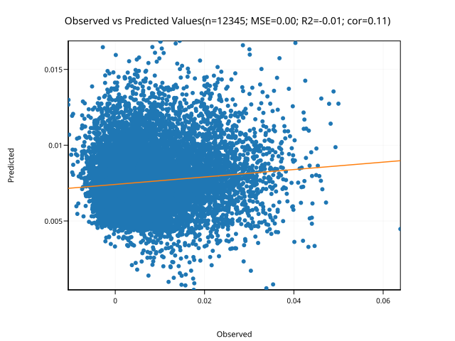
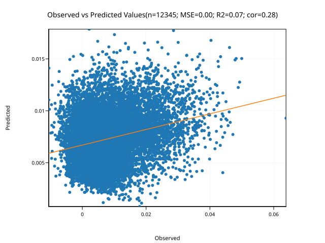
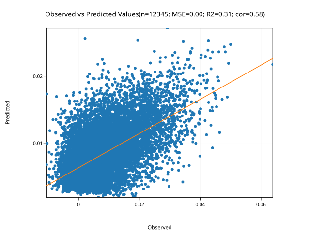
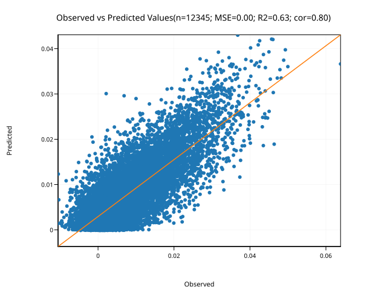

# mlp

Simple multilayer perceptron (MLP) from scratch

|**Build Status**|**License**|
|:--------------:|:---------:|
| <a href="https://github.com/jeffersonfparil/mlp/actions"></a> | [](https://www.gnu.org/licenses/gpl-3.0) |


## Setup

1. Install [pixi](https://pixi.prefix.dev/):

```shell
wget -qO- https://pixi.sh/install.sh | sh
```

2. Setup the workspace:

```shell
git clone https://github.com/jeffersonfparil/mlp.git
cd mlp
pixi init
```

3. Add cargo, cuda-nvrtc:

```shell
cd mlp
pixi shell
pixi add rust
pixi add cuda-nvrtc==12.8.93
which cargo
ls -lhtr ${PIXI_PROJECT_ROOT}/.pixi/envs/default/lib/libnvrtc*
```

## Unit testing

```shell
cd mlp
pixi shell
# export LD_LIBRARY_PATH=${PIXI_PROJECT_ROOT}/.pixi/envs/default/lib
time cargo test -- --show-output
```

## More testing

```shell
cd mlp
pixi shell
# export LD_LIBRARY_PATH=${PIXI_PROJECT_ROOT}/.pixi/envs/default/lib
time cargo run -- -h
time cargo run -- -s --verbose
INPUT=$(ls -t1 | grep "input.*.tsv" | head -n1)
head $INPUT
time cargo run -- -f $INPUT -v --n-batches=2 --n-epochs=10
MODEL=$(ls -t1 | grep "output.*.json" | head -n1)
MARGINALS=$(ls -t1 | grep "output.*-marginal_effects.tsv" | head -n1)
head $MODEL
tail $MODEL
head $MARGINALS
time cargo run -- -f $INPUT -v -m $MODEL --predict
PREDICTED=$(ls -t1 | grep "output.*-predictions.tsv" | tail -n1)
head $PREDICTED
mv $MARGINALS marginal_main.tsv
time cargo run -- -f $INPUT -v -m $MODEL --marginals --marginals-order=2
MARGINALs=$(ls -t1 | grep "output.*-marginal_effects.tsv" | head -n1)
mv $MARGINALS marginal_2nd.tsv
time cargo run -- -f $INPUT -v -m $MODEL --marginals --marginals-order=3
MARGINALs=$(ls -t1 | grep "output.*-marginal_effects.tsv" | head -n1)
mv $MARGINALS marginal_3rd.tsv
time cargo run -- -f $INPUT -v -m $MODEL --marginals --deep-shap --deep-shap-reps=100
MARGINALs=$(ls -t1 | grep "output.*-marginal_effects.tsv" | head -n1)
mv $MARGINALS deep_shap.tsv
head marginal_main.tsv
head marginal_2nd.tsv
head marginal_3rd.tsv
head deep_shap.tsv

```

## Compile for release

```shell
cd mlp
cargo build --release
./target/release/mlp -h
```

## Example Fits

Using 2 hidden layers, 128 nodes per hidden layer, ReLU activation, Adam optimiser, 0.001 learning rate and, 25% patient epochs:

### 10 Epochs



### 20 Epochs



### 50 Epochs



### 100 Epochs



## Special characters

- Used in progress bars: `█`
- Used as delimiters between non-numeric or categorical variable names and their levels: `➵`
- Used as delimiters in marginals' combinations: `▓`

## Tests on simulated data

We simulated:
- 21,000 observations of
- 1 response variable across 
- 7 years
- 20 sites
- 2 treatments
- 25 entries
- 3 replications (blocks)
- in a multi-environment trial
- in randomised complete block design (RCBD) per environment
- using a multi-layer perceptron with:
    + 1, 2, 3, 4, and 5 hidden layers whose effects are:
    + normally (μ=0, σ=1) and gamma (α=2, θ=2) distributed.

<details>

### Simulate data

```shell
cd mlp/
mkdir tests/simulated
cd tests/simulated
MLP=../../target/release/mlp
N_YEARS=7
N_SITES=20
N_TREATMENTS=2
N_ENTRIES=25
N_REPLICATIONS=3
for HIDDEN_LAYERS in $(seq 1 5)
do
    # HIDDEN_LAYERS=1
    F_NORMAL=input_simulated-NORMAL-${HIDDEN_LAYERS}HL.tsv
    F_GAMMA=input_simulated-GAMMA-${HIDDEN_LAYERS}HL.tsv
    echo "######################"
    echo "$F_NORMAL and $F_GAMMA"
    $MLP \
        --simulate-data-only \
        --simulation-n-observations $(echo "$N_YEARS*$N_SITES*$N_TREATMENTS*$N_ENTRIES*$N_REPLICATIONS" | bc) \
        --simulation-n-features-continuous 0 \
        --simulation-n-features-categorical "$N_YEARS,$N_SITES,$N_TREATMENTS,$N_ENTRIES,$N_REPLICATIONS" \
        --simulation-n-output-columns 1 \
        --simulation-n-hidden-layers ${HIDDEN_LAYERS} \
        --simulation-weights-distribution normal \
        --simulation-weights-distribution-param-1 0 \
        --simulation-weights-distribution-param-2 1 \
        --seed ${HIDDEN_LAYERS}
    F0=$(ls -lhtr input_simulated-*.tsv | tail -n1 |  rev | awk '{print $1}' | rev)
    sed 's/target_0/y/g' $F0 | sed 's/fcat_0/year/g' | sed 's/fcat_1/site/g' | sed 's/fcat_2/treatment/g' | sed 's/fcat_3/entry/g' | sed 's/fcat_4/block/g'> tmp
    mv tmp $F0
    mv $F0 $F_NORMAL
    $MLP \
        --simulate-data-only \
        --simulation-n-observations $(echo "$N_YEARS*$N_SITES*$N_TREATMENTS*$N_ENTRIES*$N_REPLICATIONS" | bc) \
        --simulation-n-features-continuous 0 \
        --simulation-n-features-categorical "$N_YEARS,$N_SITES,$N_TREATMENTS,$N_ENTRIES,$N_REPLICATIONS" \
        --simulation-n-output-columns 1 \
        --simulation-n-hidden-layers ${HIDDEN_LAYERS} \
        --simulation-weights-distribution gamma \
        --simulation-weights-distribution-param-1 2 \
        --simulation-weights-distribution-param-2 2 \
        --seed ${HIDDEN_LAYERS}
    F1=$(ls -lhtr input_simulated-*.tsv | tail -n1 |  rev | awk '{print $1}' | rev)
    sed 's/target_0/y/g' $F1 | sed 's/fcat_0/year/g' | sed 's/fcat_1/site/g' | sed 's/fcat_2/treatment/g' | sed 's/fcat_3/entry/g' | sed 's/fcat_4/block/g'> tmp
    mv tmp $F1
    mv $F1 $F_GAMMA
done
```

### Analysis using R

```R
library("lme4")
library("asreml") # requires ```shell module load ASReml-R ```

fname_input = "input_simulated-NORMAL-1HL.tsv"

process_features = function(df) {
    ids_features = c()
    for (j in 1:ncol(df)) {
        # j = 7
        if (is.character(df[, j])) {
            df[, j] = as.factor(df[, j])
            ids_features = c(ids_features, paste0(names(df)[j], sort(levels(df[, j]))))
        }
    }
    for (v in c("year", "site", "treatment", "entry", "block")) {
        if (!is.factor(df[[v]])) df[[v]] = as.factor(df[[v]])
    }
    return(list(
        df=df, 
        ids_features=ids_features
    ))
}

input_list = process_features(df=read.delim(fname_input, T))
df = input_list$df
ids_features = input_list$ids_features

str(df)
length(ids_features)

attach(df)

lm_model_strings = c(
    "lm(y ~ year + site + treatment + entry + block, data=df)",
    "lm(y ~ year * site + treatment + entry + block, data=df)"
)
lmer_model_strings = c(
    'lmer(y ~ year + site + treatment + block + (1|entry), df)',
    'lmer(y ~ year * site + treatment + block + (1|entry), df)',
    'lmer(y ~ year * site * treatment + block + (1|entry), df)',
    'lmer(y ~ year * site + treatment + block + (1 + year|entry), df)',
    'lmer(y ~ year + site + treatment + block + (1|entry) + (1|entry:year) + (1|entry:site), df)'
)
asreml_model_strings = c(
    'asreml(y ~ year + site + treatment + block, random = ~ entry, data = df)',
    'asreml(y ~ year * site + treatment + block, random = ~ entry, data = df)',
    'asreml(y ~ year * site * treatment + block, random = ~ entry, data = df)',
    'asreml(y ~ year * site + treatment + block, random = ~ entry + fa(site):entry, data = df)',
    'asreml(y ~ year * site + treatment + block, random = ~ entry + fa(year):entry, data = df)',
    'asreml(y ~ year * site * treatment + block, random = ~ entry + fa(year:site):entry, data = df)',
    'asreml(y ~ year + site + treatment + block, random = ~ entry + entry:year + entry:site, data = df)'
)
model_strings = c(lm_model_strings, lmer_model_strings, asreml_model_strings)
# Fit these models
model_candidates = list()
for (i in 1:length(model_strings)) {
    # i = 13
    # i = length(model_strings)
    mod_string = model_strings[i]
    mod_label = unlist(strsplit(mod_string, "\\("))[1]
    print(paste0("Fitting ", mod_label, "_", i, ": `", mod_string, "`"))
    mod = tryCatch(
        eval(parse(text=mod_string)),
        error = function(e) {
            print("Unable to fit: skipped!")
            return(NA)
        }
    )
    if ((length(mod) == 1) && is.na(mod)) {
        next
    } else {
        model_candidates[[paste0(mod_label, "_", i)]] = mod
    }
}
length(model_strings)
length(model_candidates)

AIC_lm_lmer_asreml = function(mod) {
    # mod = model_candidates[[13]]
    if ((class(mod) == "lm") | (class(mod) == "lmerMod")) {
        return(AIC(mod))
    } else if (class(mod) == "asreml") {
        return(-2*mod$loglik + 2*nrow(summary(mod)$varcomp))
    } else {
        print("Unknown model class. We expect 'lm', 'lme4' or 'asreml'.")
        NA
    }
}
BIC_lm_lmer_asreml = function(mod) {
    # mod = model_candidates[[13]]
    if ((class(mod) == "lm") | (class(mod) == "lmerMod")) {
        return(BIC(mod))
    } else if (class(mod) == "asreml") {
        return(-2*mod$loglik + nrow(summary(mod)$varcomp)*log(summary(mod)$nedf))
    } else {
        print("Unknown model class. We expect 'lm', 'lme4' or 'asreml'.")
        NA
    }
}
logLik_lm_lmer_asreml = function(mod) {
    # mod = model_candidates[[1]]
    if ((class(mod) == "lm") | (class(mod) == "lmerMod")) {
        return(as.numeric(logLik(mod)))
    } else if (class(mod) == "asreml") {
        return(mod$loglik)
    } else {
        print("Unknown model class. We expect 'lm', 'lme4' or 'asreml'.")
        NA
    }
}
ndf_lm_lmer_asreml = function(mod) {
    # mod = model_candidates[[13]]
    if ((class(mod) == "lm") | (class(mod) == "lmerMod")) {
        return(attr(logLik(mod), "df"))
    } else if (class(mod) == "asreml") {
        return(summary(mod)$nedf)
    } else {
        print("Unknown model class. We expect 'lm', 'lme4' or 'asreml'.")
        NA
    }
}

model_stats = data.frame(
    model = names(model_candidates),
    AIC = sapply(model_candidates, AIC_lm_lmer_asreml),
    BIC = sapply(model_candidates, BIC_lm_lmer_asreml),
    logLik = sapply(model_candidates, logLik_lm_lmer_asreml)
)
z_AIC = scale(model_stats$AIC, scale=T, center=T)
z_BIC = scale(model_stats$BIC, scale=T, center=T)
z_logLik = -scale(model_stats$logLik, scale=T, center=T)
model_stats$z_sum = 0.2*z_AIC + 0.6*z_BIC + 0.2*z_logLik
print(model_stats)

# Select the best model based on z_sum
# best_model_idx <- which.min(model_stats$BIC)
best_model_idx <- which.min(model_stats$z_sum)
best_model <- model_candidates[[best_model_idx]]
best_model_name <- names(model_candidates)[best_model_idx]
print(paste("Best model selected:", best_model_name))

# Plot entry effects (random effects for entry)
# best_model = model_candidates[[12]]
svg("test.svg")
if (class(best_model) == "lm") {
    effects = coef(best_model)
    ids = names(effects)
    intercept = effects[ids == "(Intercept)"]
    entry_effects = c(intercept, intercept + effects[grepl("entry", ids)])
    entry_names = c(as.character(levels(df$entry)[1]), ids[grepl("entry", ids)])
    entry_names = gsub("entry", "", entry_names)
    barplot(entry_effects, names.arg=entry_names, main = "Estimated Entry Effects (fixed effects model)", xlab = "Entry", ylab = "Coefficients")
}else if (class(best_model) == "lmerMod") {
    entry_effects <- ranef(best_model)$entry
    barplot(entry_effects[,1], names.arg = rownames(entry_effects), main = "Estimated Entry Effects (mixed model)", xlab = "Entry", ylab = "Random Effect")
} else if (class(best_model) == "asreml") {
    df_ranef = data.frame(
        ids = rownames(coef(best_model)$random),
        effects = as.vector(coef(best_model)$random)
    ); row.names(df_ranef) = NULL
    # str(df_ranef)
    df_sub = df_ranef[grepl("entry", df_ranef$ids) & !grepl(":", df_ranef$ids), ]
    df_sub$ids = gsub("entry_", "", df_sub$ids)
    barplot(df_sub$effects, names.arg = df_sub$ids, main = "Estimated Entry Effects (asreml model)", xlab = "Entry", ylab = "Random Effect")
} else {
    plot(0, 0)
    print("Unknown model class. We expect 'lm', 'lme4' or 'asreml'.")
}
dev.off()

detach(df)


```

### Analysis using mlp

```shell
cd mlp/
cd tests/simulated
MLP=../../target/release/mlp
for INPUT in $(ls input_simulated-*-*.tsv)
do
    # INPUT=$(ls input_simulated-*-*.tsv | head -n1)
    # INPUT=input_simulated-NORMAL-1HL.tsv
    echo $INPUT
    OUTPUT=$(echo $INPUT | sed 's/input_simulated/output_simulated/g' | sed 's/.tsv/.json/g')
    echo $OUTPUT
    time $MLP -f $INPUT -o $OUTPUT -v --n-epochs=500 --f-patient-epochs=0.1 --n-batches=1 --n-hidden-layers=1 --marginals-order=2
done
```

</details>

## Tests on empirical data


**NOTES:** 
Explanatory variables can be numeric or categorical which means that
explanatory variables which are written as numeric but are meant to be categorical 
need to be converted into strings, 
e.g. convert `reps=[1, 1, 1, 2, 2, 2, 3, 3]` into `reps=["R1", "R1", "R1", "R2", "R2", "R2", "R3", "R3"]`.

<details>

### Prepare test data

```shell
cd mlp/
cd tests/
mkdir agridat/
cd agridat/
curl -L https://codeload.github.com/kwstat/agridat/tar.gz/main | tar -xz --strip=2 agridat-main/data
```

### File checker and formatter prior to run

Save the following as `mlp/tests/agridat/scripts/prep_agridat.jl`:

```julia
using DataFrames, CSV
# ARGS = ["australia.soybean.txt", "0.1"]
# ARGS = ["henderson.milkfat.txt", "0.1"]
# ARGS = ["yates.oats.txt", "0.1"]
# ARGS = ["archbold.apple.txt", "0.1"]
# ARGS = ["acorsi.grayleafspot.txt", "0.1"]

"""
    prep_agridat_data(ARGS::Vector{String})::Nothing

Prepare agricultural dataset by identifying explanatory and response variables, 
and generating separate TSV files for each response variable.

# Arguments
- `ARGS::Vector{String}`: Command-line arguments where:
  - `ARGS[1]`: Path to input CSV file
  - `ARGS[2]`: Threshold ratio for determining if numeric columns are explanatory 
    (value between 0 and 1; columns are explanatory if unique values < threshold × nrow)

# Description
This function processes an agricultural dataset by:
1. Reading a CSV file, treating empty strings and various NA representations as missing
2. Classifying columns as explanatory or response variables based on:
   - Column names matching predefined lists
   - Data type (numeric vs. categorical)
   - Unique value count threshold for numerics
3. Converting numeric explanatory variables to categorical (prefixed with column name)
4. Filtering out rows with missing/NaN/Inf values in response variables
5. Creating separate TSV output files for each response variable with all explanatory variables

# Output
- Writes TSV files with pattern `{original_filename}-{response_variable_name}.tsv`
- Prints path of each generated output file to stdout
- Returns `nothing`

# Recognized Variable Names
- **Explanatory**: gen, pop, var, entry, env, year, loc, harvest, season, plot, rep, 
  row, col, blk, genotype, population, variety, cultivar, replication, column, block, 
  pos, position, spacing, stock, trt, treatment (and plural forms)
- **Response**: yield, grain, straw, height, size, lodging, protein, oil
"""
function prep_agridat_data(ARGS::Vector{String})::Nothing
    fname = ARGS[1]
    threshold_for_explanatory_numerics = parse(Float64, ARGS[2])
    df = CSV.read(fname, DataFrame, missingstring=["", "NA", "NAN", "NaN", "na", "nan"])
    potential_explanatory_names::Vector{String} = [
        "gen", "gens",
        "pop", "pops",
        "var", "vars",
        "entry", "entries",
        "env", "envs",
        "year", "years",
        "loc", "locs",
        "harvest", "harvests",
        "season", "seasons",
        "plot", "plots",
        "rep", "reps",
        "row", "rows",
        "col", "cols",
        "blk", "blks",
        "genotype", "genotypes",
        "population", "populations",
        "variety", "varieties",
        "cultivar", "cultivars",
        "replication", "replications",
        "column", "columns",
        "block", "blocks",
        "pos", "position", "positions",
        "spacing", "spacings",
        "stock", "stocks",
        "trt", "trts",
        "treatment", "treatments",
    ]
    potential_response_names::Vector{String} = [
        "yield",
        "grain",
        "straw",
        "height",
        "size",
        "lodging",
        "protein",
        "oil",
    ]
    # Identity explanatory and response variables
    (explanatory_names, response_names) = let
        explanatory_names::Vector{String} = []
        response_names::Vector{String} = []
        for j in 1:ncol(df)
            # j = 4
            id = names(df)[j]
            col = df[:, j]
            if id ∈ potential_explanatory_names
                # If the explanatory variable but it is not supposed to, i.e. all elements of potential_explanatory_names are assumed to be categorical
                # then we convert the numerics into categoricals
                if isa(col, Vector) && isa(col[1], Number)
                    df[!, id] = string.(id, "|", df[!, id])
                end
                push!(explanatory_names, id)
            elseif id ∈ potential_response_names
                if isa(col, Vector) && isa(col[1], Number)
                    push!(response_names, id)
                else
                    # We expect the response variables to be numeric if they are not then we skip
                    continue
                end
            elseif isa(col, Vector) # Numerics are Vectors in DataFrames
                if length(unique(col)) < threshold_for_explanatory_numerics*nrow(df) # likely not a response variable because of the limited (controlled by threshold_for_explanatory_numerics) number of unique values
                    push!(explanatory_names, id)
                else
                    push!(response_names, id)
                end
            else # Strings are not Vectors in DataFrames
                push!(explanatory_names, id)
            end
        end
        # In cases where there are no response variables detected because the response variable is numeric but with limited number of unique values,
        # then we arbitrarily relax the `threshold_for_explanatory_numerics` so that `threshold_for_explanatory_numerics*nrow(df) == 10`
        if length(response_names) == 0
            explanatory_names_repeat::Vector{String} = []
            response_names_repeat::Vector{String} = []
            RELAXED_THRESHOLD = 10
            for j in 1:ncol(df)
                # j = 4
                id = names(df)[j]
                col = df[:, j]
                if id ∈ potential_explanatory_names
                    # If the explanatory variable but it is not supposed to, i.e. all elements of potential_explanatory_names are assumed to be categorical
                    # then we convert the numerics into categoricals
                    if isa(col, Vector) && isa(col[1], Number)
                        df[!, id] = string.(id, "|", df[!, id])
                    end
                    push!(explanatory_names_repeat, id)
                elseif id ∈ potential_response_names
                    if isa(col, Vector) && isa(col[1], Number)
                        push!(response_names_repeat, id)
                    else
                        # We expect the response variables to be numeric if they are not then we skip
                        continue
                    end
                elseif isa(col, Vector) # Numerics are Vectors in DataFrames
                    if length(unique(col)) < RELAXED_THRESHOLD
                        push!(explanatory_names_repeat, id)
                    else
                        push!(response_names_repeat, id)
                    end
                else # Strings are not Vectors in DataFrames
                    push!(explanatory_names_repeat, id)
                end
            end
            (explanatory_names_repeat, response_names_repeat)
        else
            (explanatory_names, response_names)
        end
    end

    # Subset the data so that the first column corresponds to a single response variable and the rest are the explanatory variables
    if (length(explanatory_names) == 0) || (length(response_names) == 0)
        # No explanatory or response variables detected automatically just emit an empty string
        println("")
        return nothing
    else
        # Save each dataset with one response variable each
        for y_name in response_names
            # y_name = response_names[1]
            idx::Vector{Int64} = findall(.!ismissing.(df[!, y_name]) .&& .!isnan.(df[!, y_name]) .&& .!isinf.(df[!, y_name]))
            df_sub::DataFrame = select(df, vcat([y_name], explanatory_names))[idx, :]
            # We use the length of the explanatory_names as marker for where to start the indices of the response variable for mlp
            fname_out_tsv = string(join(split(fname, ".")[1:(end-1)], "."), "-", y_name, ".tsv")
            CSV.write(fname_out_tsv, df_sub, delim="\t")
            # println("explanatory_names: $explanatory_names")
            # println("response_names: $response_names")
            println(fname_out_tsv)
        end
    end
    nothing
end
prep_agridat_data(ARGS)
```

### Run tests on empirical data

```shell
cd mlp/
cd tests/agridat/
MLP=../../target/release/mlp

for FILE in $(find . -name "*.txt")
do
    # FILE=$(find . -name "*.txt" | sort | head -n1 | tail -n1)
    # FILE=archbold.apple.txt
    # FILE=acorsi.grayleafspot.txt
    # FILE=alwan.lamb.txt
    echo $FILE
    DIR_OUTPUT=OUTPUT-$(basename ${FILE%.txt*})
    echo $DIR_OUTPUT
    mkdir $DIR_OUTPUT
    FILE_INPUTS=$(julia +1.12 --project=. scripts/prep_agridat.jl $FILE 0.1)
    echo $FILE_INPUTS
    # head $FILE_INPUTS
    if [ "$FILE_INPUTS" == "" ]
    then
        echo "Skipping empty explanatory/response variables"
    else
        for FILE_INPUT in $FILE_INPUTS
        do
            # FILE_INPUT=$(echo $FILE_INPUTS | cut -d' ' -f1)
            FILE_OUTPUT=${FILE_INPUT%.tsv*}.json
            echo $FILE_OUTPUT
            time $MLP \
                -f $FILE_INPUT \
                -o $FILE_OUTPUT \
                -t 0 \
                -v \
                --n-batches 1 \
                --n-hidden-layers 3 \
                --n-epochs 100 \
                --marginals-order 2 \
            > out.tmp
            FNAME_LOSS=$(grep "Find the loss curve saved as:" out.tmp | cut -d ':' -f2 | cut -d ' ' -f2)
            FNAME_SCAT=$(grep "Find the observed vs predicted scatterplot saved as:" out.tmp | cut -d ':' -f2 | cut -d ' ' -f2)
            FNAME_BARM=$(grep "Find the marginal effects" out.tmp | cut -d ':' -f2 | cut -d ' ' -f2)
            FNAME_MODEL=$(grep "Please find the output model (network) in json format:" out.tmp | cut -d ':' -f2 | cut -d ' ' -f2)
            FNAME_MARGINALS=$(grep "Please find the estimated marginal effects in tab-delimited format:" out.tmp | cut -d ':' -f2 | cut -d ' ' -f2)
            mv $FNAME_MODEL ${DIR_OUTPUT}/$(basename $FNAME_MODEL)
            mv $FNAME_MARGINALS ${DIR_OUTPUT}/$(basename $FNAME_MARGINALS)
            mv $FNAME_LOSS ${DIR_OUTPUT}/${FILE_INPUT%.tsv*}-$(basename $FNAME_LOSS)
            mv $FNAME_SCAT ${DIR_OUTPUT}/${FILE_INPUT%.tsv*}-$(basename $FNAME_SCAT)
            mv $FNAME_BARM ${DIR_OUTPUT}/${FILE_INPUT%.tsv*}-$(basename $FNAME_BARM)
            rm out.tmp
            rm $FILE_INPUT
        done
    fi
done
```

</details>

## MLPInterrogator.jl

Planning on making an `mlp` model interrogator, i.e. an interactive Julia library to interrogate the model output (`*.json*`).
I anticipate users to ask: What if I want to see how some of the same categorical factor levels (e.g. a subset of entries in a yield trial) perform under some other categorical factor levels or continuous explanatory variable values they did not have empirical observations on (e.g. on a different set of environments)? --> Now, that I've written this down, the `--predict-only` flag does this. However, the new input feature data needs to be generated by-hand and so this interactive Julia tool is better poised to just generate these new sets of input data sets (with dummy target values set as NAN) for use with `mlp`!

